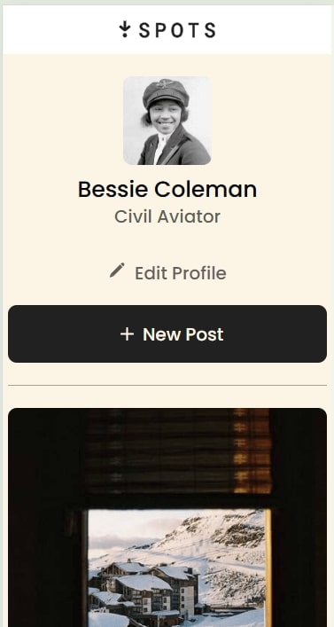

# The Spots Platform

## Spots: Limitlessly Deepening Human Connection Through Photography

The Spots User Platform allows creation of profiles, uploading and sharing content such as photos primarily, but potentially other content and discussion as well.

Imagine a simple and user-centered interface meant to allow truly focused immersion in the fulfillment of the primary purpose of the type of user that the platform as whole is meant to service: people who want to come together through photography, and reminisce togther person to person in an >>ad free<< environment where the primary focus can finally be each other.

Now take this image and cross reference it with your memories of being pulled away by external third party ads that frequently, repeatedly throw the brakes on these potential moments of indefinite deepening of interpersonal connection, and consequently reduce the average global attention span down to below one minute as I'm sure you and we can all attest to.

It is currently in early early alpha stage and is funtionally only a teaser as to what it can be capable of in coming future release(s), as is this description of it, but if this kind of deeper and more fulfilling interpersonal experience through photography sounds fulfilling to you, then here is your means to this end!

Useable on  and !

[Here is a video describing the project!](https://drive.google.com/file/d/1h6UywWaiA3tJqUl42426rEZiN7ZKUDJK/view?usp=sharing)

## Tech Stack

- HTML
- CSS
- Responsive Design

## Deployment

This webpage is deployed to GitHub Pages

- [Deployment Link](https://connoraddison.github.io/spots_platform/)

**Figma**

- [Link to the project on Figma](https://www.figma.com/file/BBNm2bC3lj8QQMHlnqRsga/Sprint-3-Project-%E2%80%94-Spots?type=design&node-id=2%3A60&mode=design&t=afgNFybdorZO6cQo-1)
